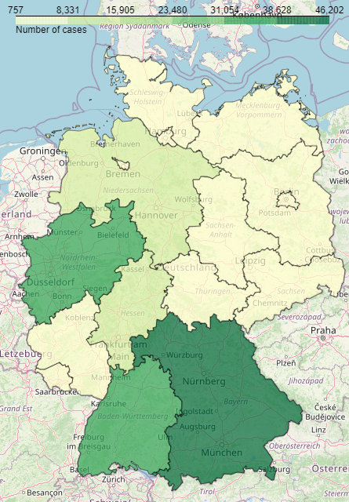

# Germany Coronavirus Cases per Federal State

Visualization of cases in every Federal State of Germany. 

<a href="https://npgeo-corona-npgeo-de.hub.arcgis.com/datasets/dd4580c810204019a7b8eb3e0b329dd6_0">Data</a> from Robert Koch Institut.

Geojson data from <a href="https://github.com/isellsoap/deutschlandGeoJSON">here</a>.

Libraries used pandas, matplotlib, folium

